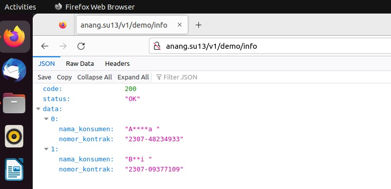

## Framework

> [Go Fiber](https://docs.gofiber.io/)\
> [Gorm ORM](https://gorm.io/docs/)\
> MySQL\
> [Sql driver mock for Golang](https://github.com/DATA-DOG/go-sqlmock)

## Instalasi

```ruby
git clone git@github.com:anang5u/demo-ddd-clean-architecture.git
cd demo-ddd-clean-architecture
docker-compose up
```

atau

```ruby
docker-compose up -d
```

## Uninstal

```ruby
docker-compose down -v
```

## Fitur

|       | | |
| ----------- | ----------- |---|
| Auto Migration  | | |
| Auto Generate Cicilan | | |
| Info Tagihan | GET| http://127.0.0.1:4321/v1/demo/info |
| Cek Tagihan| GET| http://127.0.0.1:4321/v1/demo/inquiry/{nomor_kontrak} |
| Bayar Tagihan| POST| http://127.0.0.1:4321/v1/demo/payment |
| Token| POST| http://127.0.0.1:4321/v1/demo/token |
| Detail Pembayaran| GET| http://127.0.0.1:4321/v1/demo/payment/{id_transaksi} |
|       | | |

## Asset Pendukung

> [Postman Collection](assets/DDD-Demo.postman_collection.json)\
> [File SQL](assets/db_demo.sql)\
> [Docker Image (ddd-demo-image)](https://hub.docker.com/r/anangsu13/ddd-demo-image)

## Arsitektur


## Database


## Kubernetes
#### :white_check_mark:  Minikube - Ubuntu 22.04.02
```ruby
minikube start
minikube addons list
minikube addons enable ingress
```

```ruby
kubectl create namespace ddd-demo
kubectl apply -f kubernetes-deployment-local.yaml
```

```ruby
kubectl -n demo-ddd get deployment
kubectl -n demo-ddd get service
kubectl -n demo-ddd get pod
```
mapping IP Address ke hostname:
```ruby
kubectl -n demo-ddd get ingress
```
| NAME | CLASS | HOSTS | ADDRESS | PORTS | AGE |
| ---- | ----- | ----- | ------- | ----- | --- |
| demo-ddd-ingress | nginx | **anang.su13** | **192.168.49.2** | 80 | 40m |

```ruby
sudo nano /etc/hosts
```
> 127.0.0.1        localhost\
> **192.168.49.2     anang.su13**

:rocket: Jika pengaturan sudah sesuai, *demo-ddd-app-local* sudah bisa diakses via browser atau postman


:bathtub: bersih-bersih:
```ruby
kubectl delete namespace demo-ddd
```
