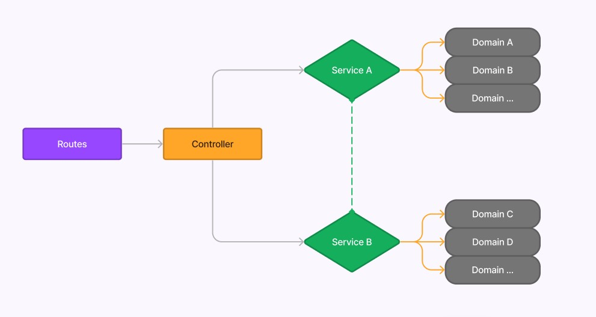
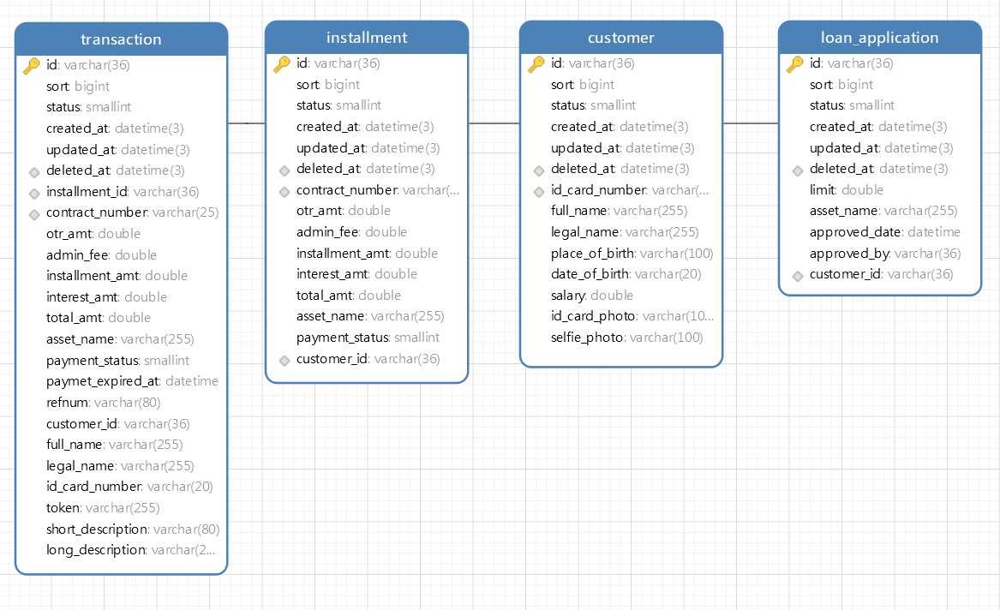

## Framework

> [Go Fiber](https://docs.gofiber.io/)\
> [Gorm ORM](https://gorm.io/docs/)\
> MySQL\
> [Sql driver mock for Golang](https://github.com/DATA-DOG/go-sqlmock)

## Instalasi

```ruby
git clone git@github.com:anang5u/demo-ddd-clean-architecture.git
cd demo-ddd-clean-architecture
docker-compose up
```

atau

```ruby
docker-compose up -d
```

## Uninstal

```ruby
docker-compose down -v
```

## Fitur

|       | | |
| ----------- | ----------- |---|
| Auto Migration  | | |
| Auto Generate Cicilan | | |
| Info Tagihan | GET| http://127.0.0.1:4321/v1/demo/info |
| Cek Tagihan| GET| http://127.0.0.1:4321/v1/demo/inquiry/{nomor_kontrak} |
| Bayar Tagihan| POST| http://127.0.0.1:4321/v1/demo/payment |
| Token| POST| http://127.0.0.1:4321/v1/demo/token |
| Detail Pembayaran| GET| http://127.0.0.1:4321/v1/demo/payment/{id_transaksi} |
|       | | |

## Asset Pendukung

> [Postman Collection](assets/DDD-Demo.postman_collection.json)\
> [File SQL](assets/db_demo.sql)\
> [Docker Image (ddd-demo-image)](https://hub.docker.com/r/anangsu13/ddd-demo-image)

## Arsitektur


## Database
